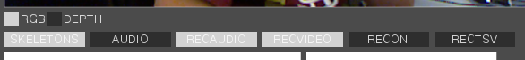
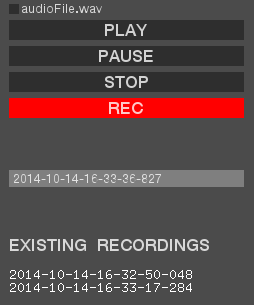
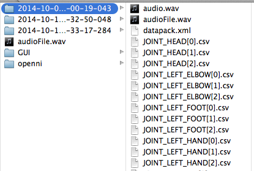
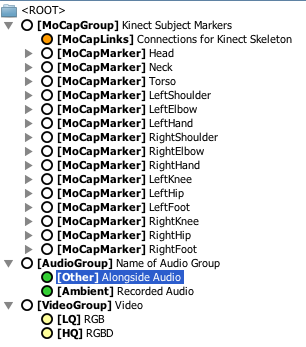

# KinectVizz

KinectVizz is an application for recording motion capture (MoCap) data from a MS Kinect aligned with other streams and export a [repoVizz](http://repoVizz.upf.edu/) datapack. The current version allows to record:

* MoCap data.
* Audio
* RGB video
* RGBD video (depth image) 
* OpenNI [ONI file](http://structure.io/openni) 

Dependencies for building:
* [openFrameworks](http://www.openframeworks.cc/)
* [ofxOpenNI](https://github.com/gameoverhack/ofxOpenNI). ofxAddon for accessing Kinect data (video and skeleton tracking).
* [ofxVideoRecorder](https://github.com/timscaffidi/ofxVideoRecorder). ofxAddon for video recording.
* [libsndfile](http://www.mega-nerd.com/libsndfile/) for audio recording.
* [ofxUI](https://github.com/rezaali/ofxUI). ofxAddon for the GUI.

An XCode project is provided to build on OSX.

## The Datapack
RepoVizz is an integrated online system capable of structural formatting and remote storage, browsing, exchange, annotation, and visualization of synchronous multi-modal, time-aligned data.
From the [repoVizz tutorial](http://repoVizz.upf.edu/misc/repoVizzTutorial.pdf):

>repoVizz data entities are constituted as collections of time-synchronous multi-modal data files (signals or annotations) organized in a tree structure that holds pointers to such files, associated metadata, text-based descriptions, and pointers to supplementary files. The tree structure is implemented by means of a customary XML file, the repoVizz Struct, which is hierarchically formed by different types of nodes with functions ranging from organizing data or holding text descriptions to holding pointers to data files of different types. The logical entity formed by a repoVizz Struct and all files pointed by its nodes is a repoVizz **Datapack**

**KinectVizz** allows to perform a multimodal recording using MS Kinect, generating a ready-to-upload aligned repovizz datapack.

## Recording and uploading a datapack

### 1. Select data streams
When recording a datapack, the first thing to decide is which data streams need to be **recorded** and **included in the datapack**.

* **AUDIO** - allows to play an audio file while recording (e.g. useful for recording users following some sound). `wav` and `mp3` format are supported.
* **RECAUDIO** - records audio from the default input device.
* **RECVIDEO** - records RGB and RGBD Kinect videos.
* [not in datapack] **RECONI** - records ONI binary file.
* [not in datapack] **RECTSV** - records `.tsv` file containing the position of all joints at every frame. It is formatted in the same way as the `.tsv` format produced by the [Qualisys Motion Capture](http://www.qualisys.com/) system.

### 2. Select name for datapack
By default, the current timestamp is set as the name for the recording. A folder with the name will be generated once the recording is over.

### 3. Start recording
By clicking on the **REC** button, all selected data streams start to be recorded. Clicking again on **REC** or **STOP** ends the recording.

##### Recording while playing an audio
If **AUDIO** is active (to play an audio file while recording), one of the files over the play button should be selected. Any `wav` or `mp3` file in the `data` folder will be available for selection. The **PLAY**, **PAUSE** and **STOP** buttons can be used to pre-listen the audio.

### 4. Open the datapack with the *Datapack Designer*
When the recording is over, a new folder is created containing all the necessary files for creating the repovizz datapack.

The [**repoVizz datapack designer**](http://repovizz.upf.edu/designer/) allows to visualize (and modify) the recording structure and generate the final `zip` file that can be uploaded to repoVizz.

Just change the location to the folder of the desired recording and open `datapack.xml`. The datapack designer shows the data structure. Click on "Generate datapack" to create the `zip` file.

### 5. Upload the datapack
Go to [repovizz.upf.edu](http://repovizz.upf.edu), login and upload your datapack in the "Manage" section. repoVizz can automatically compute audio descriptors of your audio files using [Essentia](http://essentia.upf.edu/).

## Credits
Copyright © 2017  Music Technology Group - Universitat Pompeu Fabra / Escola Superior de Música de Catalunya

Application designed and developed by [Álvaro Sarasúa](http://www.alvarosarasua.com) within the [PHENICX](http://phenicx.upf.edu) project.

RepoVizz is being developed since 2010 within the Music Technology Group (Universitat Pompeu Fabra) thanks to the support of a number of grants and projects including: TECNIO grant by the Catalan government, EU-FP7-FET Project SIEMPRE and EU-FP7-STREP Project PHENICX.

